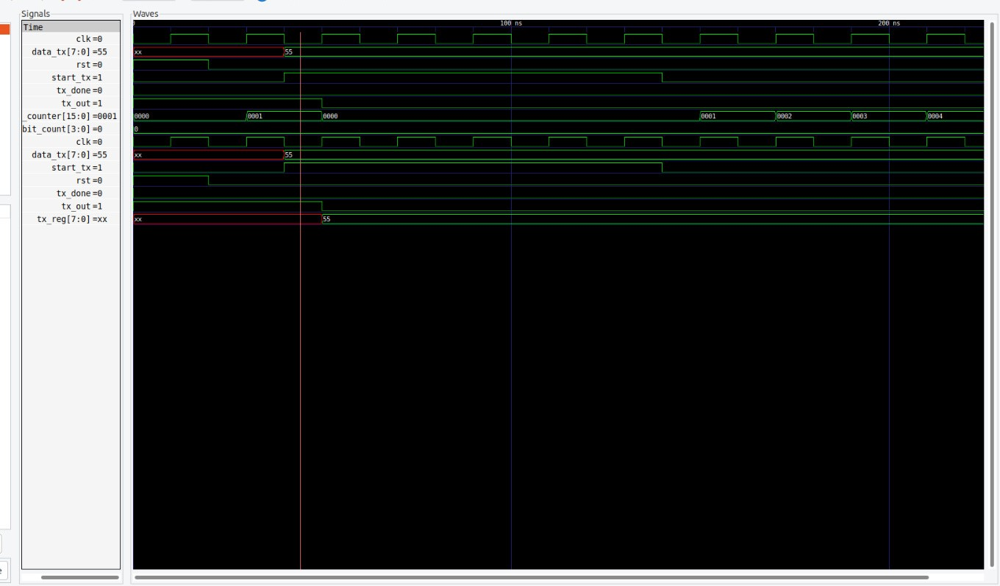
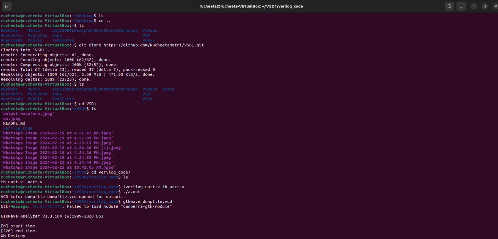

# A 4-week Research Internship on VSDSquadron Mini RISC-V Dev Board


BOARD SPECIFICATIONS:

| Tech specs   |   |    |
|------------|------------|------------|
| *Board* | Name     | VSDSquadron Mini    |
|      | SKU    | VSDSQM    |
| *Microcontroller*    | CH32V003F4U6 chip with 32-bit RISC-V core based on RV32EC instruction set    |     |
| *USB connector* | USB 2.0 Type-C    |     |
| *Pins*     | Built-in LED Pin     | 1X onboard user led (PD6)     |
|      | Digital I/O pins     | 15     |
|      | Analog I/O pins     | 10-bit ADC, PD0-PD7, PA1, PA2, PC4     |
|      | PWM pins     | 14X     |
|      | External interrupts     | 	8 external interrupt edge detectors, but it only maps one external interrupt to 18 I/O ports     |
| *Communication*     | USART     | 	1x, PD6(RX), PD5(TX)     |
|      | I2C     | 1x, PC1(SDA), PC2(SCL)    |
|      | SPI     | 1x, PC5(SCK), PC1(NSS), PC6(MOSI), PC7(MISO)     |
|      | Programmer/debugger     | Onboard RISC-V programmer/debugger, USB to TTL serial port support     |
| *Power*     | I/O voltage     | 3.3 V    |
|      | Input voltage (nominal)     | 5 V    |
|      | Source Current per I/O Pin    | 8 mA     |
|      | Sink Current per I/O Pin     | 8 mA     |
| *Clock speed*     | Processor    | 24 MHz     |
| *Memory*     | SRAM     | 2kb onchip volatile sram,16kb external program memory     |
   

This repo is intended to document the weekly progress.

### The first online meet was held on 16th of Feb 2024 @6PM

<details>
    <summary> TASK 1 </summary>
 
1) install Yosys 

2) install iverilog 

3) install gtkwave

### CLONING RISC-V GNU TOOLCHAIN

# To install git 
```
sudo apt install git-all
```   

 make sure to install the dependencies


### INSTALLING YOSYS, IVERILOG & GTKWAVE.

### 1.YOSYS

```
git clone https://github.com/YosysHQ/yosys.git
```

```
cd yosys 

sudo apt install make

sudo apt-get install build-essential clang bison flex \libreadline-dev gawk tcl-dev libffi-dev git \ graphviz xdot pkg-config python3 libboost-system-dev\libboost-python-dev libboost-filesystem-dev zlib1g-dev

make config-gcc
```
.jpeg>)
```
make 

sudo make install
```


### 2.iVerilog
installing iVerilog
```
sudo apt update

sudo apt-get install iverilog
```


### 3.GTkWave
installing GTkWave
```
 sudo apt-get install gtkwave 
 ```


</details>


### The second online meet was held on 20th of Feb 2024 @6PM
<details>
    <summary> TASK 2 </summary>


## Universal Asynchronous Receiver Transmitter protocol based on hardware transmitter:


In UART communication, two UARTs communicate directly with each other. The transmitting UART converts parallel data from a controlling device like a CPU into serial form, transmits it in serial to the receiving UART, which then converts the serial data back into parallel data for the receiving device. Only two wires are needed to transmit data between two UARTs. Data flows from the Tx pin of the transmitting UART to the Rx pin of the receiving UART:


### Output Waveform of UART:



</details>


### The third online meet was held on 22th of Feb 2024 @6PM
<details>
    <summary> TASK 3 </summary>

### UART:

 *Cloning my github repositories:*    
  
```git clone https://github.com/RucheetaMetri/VSD1.git```

```cd VSD1```

```cd verilog_code```

```iverilog uart.v tb_uart.v```

*Generating dump_file*

```./a.out```

*To get I/O waveform*

```gtkwave dumpfile.vcd```




### Wave Forms:

 


</details>

### The fourth online meet was held on 27th of Feb 2024 @6PM
<details>
    <summary> TASK 4 </summary>

  *Invoking yosys inside verilog_code file:* 

```yosys```

*Reading the Library:*    

```read_liberty -lib sky130_fd_sc_hd__tt_025C_1v80.lib```

*Reading the Design:*    

```read_verilog uart.v```

*Specifying the module that we are synthesizing:*    

```synth -top uart```
 


    


*To generate the netlist:*    

```abc -liberty sky130_fd_sc_hd__tt_025C_1v80.lib```


*Using the switch '-noattr' to get the simplified version of netlist file:*    

```write_verilog -noattr uart_netlist.v```

*To see the graphical version of the logic:*    

```show```

*To exit*

```exit```

*To check whether the netlist will match with the Design:*

 ```iverilog primitives.v sky130_fd_sc_hd.v uart_netlist.v tb_uart.v``` 

```./a.out``` 

 ```gtkwave dumpfile.vcd```


*GTKWAVE of netlist*


</details>

### The Fivth online meet was held on 1th of Mar 2024 @6PM

<details>
    <summary> TASK 5 </summary>


*Design file after git clone*

*We are checking gtkwave for the design*

```iverilog iiitb_uarttx.v iiitb_uarttx_tb.v```

```./a.out ```

``` gtkwave dump.vcd```


    


*Design Wave:*


*Invoking yosys :* 

```yosys```

*Reading the Library:*    

```read_liberty -lib lib/sky130_fd_sc_hd__tt_025C_1v80.lib```

*Reading the Design:*    

```read_verilog iiitb_uarttx.v```


*Specifying the module that we are synthesizing:*    

```synth -top UART_TX```

.jpeg>)


*To generate the netlist:*    

```abc -liberty lib/sky130_fd_sc_hd__tt_025C_1v80.lib```

*To write the netlist:*  

```write_verilog iiitb_uarttx_netlist.v```

*To see the graphical version of the logic:*    

```show```

*Using the switch '-noattr' to get the simplified version of netlist file:*  

```write_verilog -noattr iiitb_uarttx_netlist.v```

*To open the netlist:*    

```!gvim iiitb_uarttx_netlist.v```


.jpeg>)

.jpeg>)

.jpeg>)

.jpeg>)

*To check whether the netlist will match with the Design:*

 ```iverilog primitives.v sky130_fd_sc_hd.v iiitb_uarttx_netlist.v iiitb_uarttx_tb.v``` 

```./a.out``` 

 ```gtkwave dump.vcd```


.jpeg>)

*GTKWAVE of netlist*

.jpeg>)

</details>
